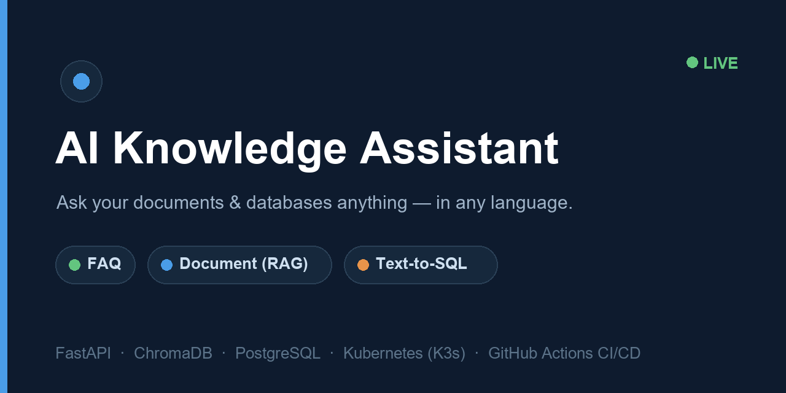
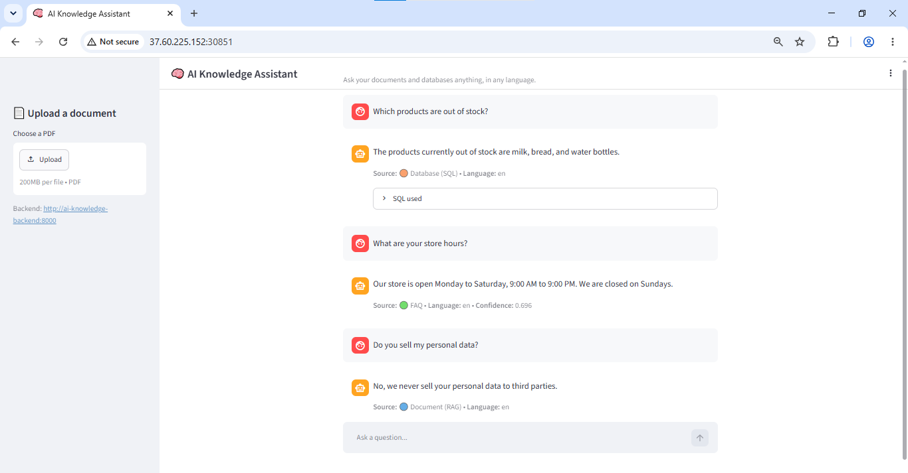
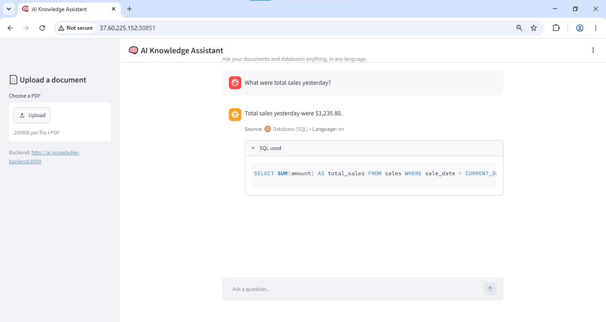
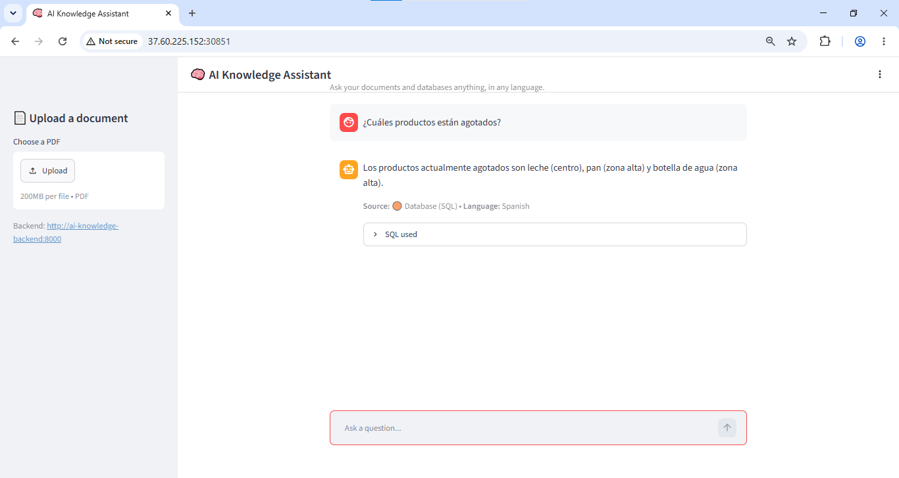

<p align="center">
  
</p>

# 🧠 AI Knowledge Assistant (RAG + SQL)

> Ask your documents and databases anything — in any language. One chat box, four AI engines, honest answers.

<p>
  
  
  
  
  
  
  
  
</p>

## ▶️ Live demo

### 🔒 **https://rag.usman7888.com**

_(Deployed 24/7 on a K3s cluster, HTTPS via Traefik Ingress + cert-manager + Let's Encrypt. Also reachable at http://37.60.225.152:30851. The first database question may take a second — the managed database wakes from idle.)_

Try asking:
- *"Which products are out of stock?"* → answered from a **database** (Text-to-SQL)
- *"What is your return policy?"* → answered from an uploaded **PDF** (RAG)
- *"What are your store hours?"* → answered from the **FAQ**
- *"¿Cuáles productos están agotados?"* → answered **in Spanish**
- *"Who won the 2010 World Cup?"* → *"I don't have information on that."* (no hallucinating)

---

## What it does

A single `/ask` endpoint that classifies each question and routes it to the right engine, then answers in the user's language — with an honest fallback instead of making things up.

| Engine | Answers from | Example |
|--------|-------------|---------|
| 🔵 **Document Q&A (RAG)** | uploaded PDFs (vector search) | "What's the refund policy?" |
| 🟠 **Database (Text-to-SQL)** | a PostgreSQL database | "What were sales yesterday?" |
| 🟢 **FAQ** | a curated knowledge base | "How do I reset my password?" |
| 🌍 **Multi-language** | translates in → answers → translates back | ask in Spanish, French, etc. |
| 💬 **Conversational memory** | rewrites follow-ups using chat history | "…and what about the onsite store?" |
| ⚪ **Honest fallback** | says "I don't know" when it should | prevents confident wrong answers |

Every answer shows its **source** (FAQ / Document / Database) and, for database answers, the **exact SQL** used — so results are transparent and trustworthy.

---

## Architecture

```
                        👤 User (any language)
                               │
                        ┌──────────────┐
                        │  Streamlit   │  chat UI + PDF upload
                        └──────┬───────┘
                               │ REST
                        ┌──────────────┐
                        │   FastAPI    │  POST /ask, /upload
                        └──────┬───────┘
                               ▼
                        ┌──────────────┐
                        │ SMART ROUTER │  memory → translate → classify → dispatch
                        └──┬────┬────┬─┘
                 ┌─────────┘    │    └─────────┐
                 ▼              ▼              ▼
            ┌─────────┐   ┌──────────┐   ┌─────────┐
            │   RAG   │   │ Text-SQL │   │   FAQ   │
            │ChromaDB │   │  Neon PG │   │faqs.json│
            └─────────┘   └──────────┘   └─────────┘
                 └──────────────┼──────────────┘
                                ▼
                    LLM (Gemini via LiteLLM)
             writes grounded answers · translates · generates SQL
```

**Design principle:** every engine returns the same `{answer, source, ...}` shape, so the router treats them interchangeably. Retrieval (RAG/FAQ) uses local embeddings; the database path uses the LLM to generate a **read-only** SQL query (guarded against writes and injection). Grounded prompts keep the LLM from answering outside the provided data.

---

## Tech stack

| Layer | Tech |
|-------|------|
| **Frontend** | Streamlit |
| **Backend** | Python 3.11, FastAPI |
| **LLM** | Gemini via LiteLLM (provider-agnostic) |
| **Embeddings** | sentence-transformers (`all-MiniLM-L6-v2`, local) |
| **Vector store** | ChromaDB |
| **Database** | PostgreSQL (Neon, managed) |
| **Containers** | Docker (CPU-only torch), GHCR |
| **Orchestration** | K3s + Helm (ChromaDB on a PVC, readiness probes) |
| **HTTPS / domain** | Traefik Ingress + cert-manager + Let's Encrypt (auto-renewing TLS) |
| **CI/CD** | GitHub Actions → build → GHCR → SSH → `helm upgrade` |

---

## Screenshots

**One chat box, the right engine for each question** — note the source badge on every answer (Database / FAQ / Document):

<p align="center">
  
</p>

| Text-to-SQL — shows the generated query | Multi-language — ask in Spanish, answer in Spanish |
|:---:|:---:|
|  |  |

---

## Run locally

**Backend**
```bash
cd backend
python -m venv venv && venv/Scripts/activate      # or source venv/bin/activate
pip install -r requirements.txt
cp .env.example .env                               # add your GEMINI_API_KEY + DATABASE_URL
uvicorn app.main:app --port 8000
```

**Frontend** (in another terminal)
```bash
cd frontend
python -m venv venv && venv/Scripts/activate
pip install -r requirements.txt
streamlit run streamlit_app.py                     # http://localhost:8501
```

**Load sample data** (once)
```bash
python db/import.py                                 # creates tables + imports CSVs into PostgreSQL
```

---

## Deployment

Push to `main` → **GitHub Actions** builds both images, pushes them to **GHCR**, SSHes into the VPS, and runs **`helm upgrade`** on the **K3s** cluster. The chart handles a startup probe (slow ML boot), a PersistentVolumeClaim for ChromaDB, and injects secrets at deploy time. PostgreSQL is offloaded to **Neon** (managed), so only the vector store needs persistence.

```
git push → Actions → build → GHCR → SSH → helm upgrade → K3s (live)
```

---

## Why this project

Built to demonstrate production-grade **applied AI + DevOps**: retrieval-augmented generation, Text-to-SQL, intent routing, multi-language, and conversational memory — packaged in containers and deployed to a Kubernetes cluster with a full CI/CD pipeline.
